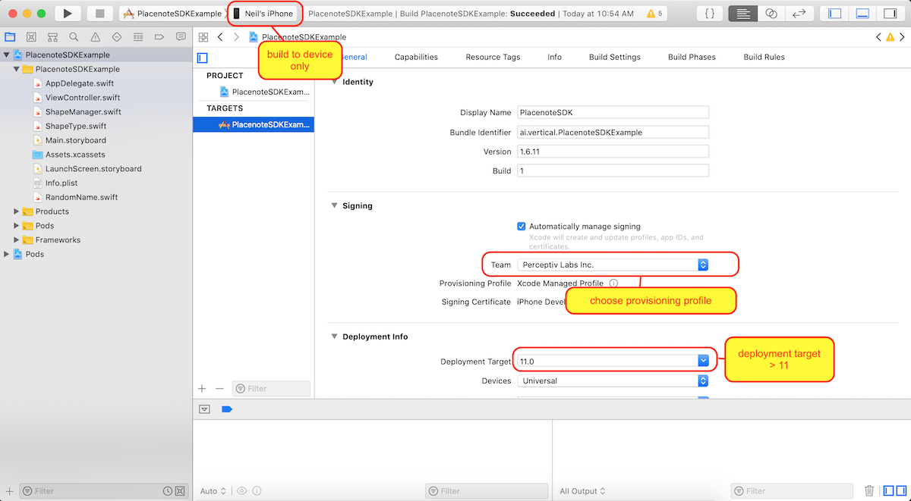
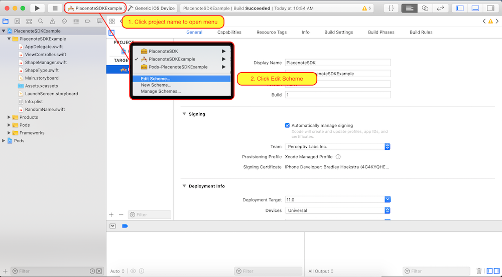
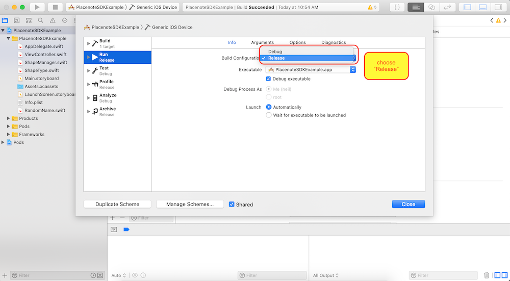

# Build and run the SDK sample code
Now that you have tested the demo app on your iOS device, it's time to try downloading and building the sample app yourself. This will help you verify that you can build Placenote apps using XCode onto your iOS device without any issues. Great job so far!

## Step 1: Download the Sample app bundle
Download the [latest sample app bundle.](https://github.com/Placenote/PlacenoteSDK-iOS/releases/download/v1.6.12/PlacenoteSDKExample.tar.gz)

## Step 2: Open project in XCode and add your API key
1. Open the project by opening *PlacenoteSDKExample.xcworkspace* in XCode.
2. In the project explorer, under the *PlacenoteSDKExample* folder, open file named *AppDelegate.swift*. You will find the following line of code1:
 ```
 LibPlacenote.instance.initialize(apiKey: "Enter_API_KEY_here")
  ```

    Replace `"Enter_API_KEY_here"` with your API key in quotes *"your_api_key"*

## Step 3: Build and run the app on an iOS device

Choose the Build Target as PlacenoteSDKExample, set your Provisioning Profile and ensure that the Deployment Target is 11 or higher. Connect your iPhone or iPad to your computer and set it as your build device.



For best results, we’ll build the app in release mode. To change your build scheme, click the **PlacenoteSDKExample** button right beside target device button and click **Edit Scheme** in the drop-down menu.



Change Build Configuration to **Release** and uncheck **Debug executable**.



And that's it!! Click *Build* (The play button in XCode) and let the app build to your iOS device. If everything goes well you should see the app running on your device. If you see the app running on your device and the camera feed starts, you can try creating and saving a map! :rocket:. Once you save a map, you can go to the next section, [Managing your maps](managing-your-maps.md)


## Troubleshooting

Sometimes luck just isn't on your side. Luckily, we are! :wink: Check out our [Build instructions checklist](build-instructions.md) to fix any issues you may be having with the build.
