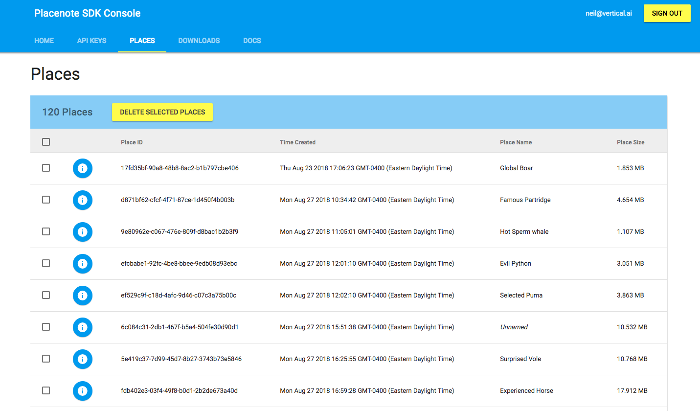
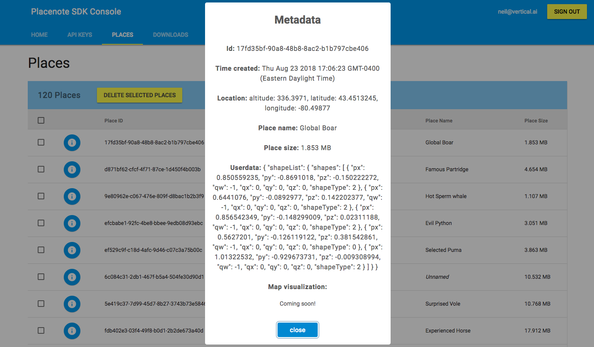

# Managing your maps

Placenote gives you complete control over the maps you create through the online developer portal. You can use the developer portal to view and delete your maps whenever you want and it also serves as an easy way to debug your app when you start saving meta data and asset data with your maps.

Let's take a look at your maps. [Visit the developer portal and sign in](https://developer.placenote.com).

Now click on the "Places" tab.

!!! tip
    If you have trouble loading the "Places" tab, just refresh the page and try again.

If you saved some maps with shapes using the *RandomShapes* sample scene you compiled in the previous step, you will find a list of maps under the places tab that looks like this.

Here, you can view the mapID of each map you have created, along with its time of creation, custom name and storage size. You can also select and delete your maps whenever you need to.

!!! warning
    Deleting a map is a irreversible action.

If you saved some shapes with the map, you can view the content associated with a map, by clicking the "i" icon beside a map. You'll see a popup that contains the content as JSON in the **Userdata** field. The screenshot below shows an example.

