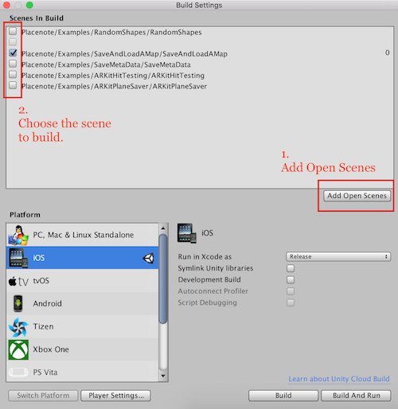
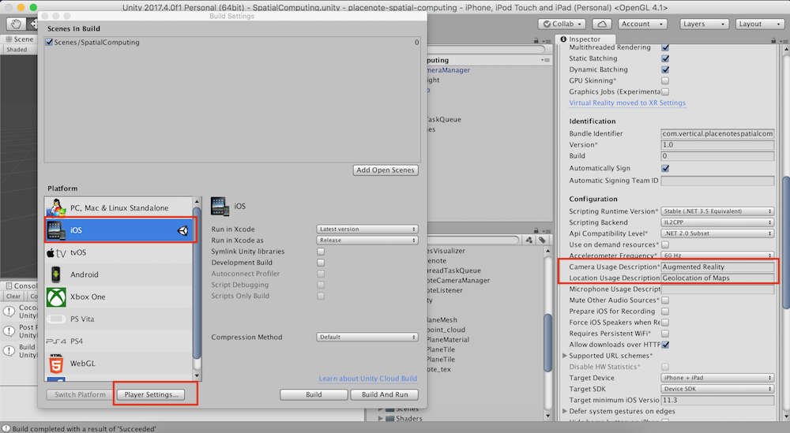

# Build Instructions
Use these instructions whenever you're building a Placenote app. You can also use this as a checklist when troubleshooting any build issues you might have. If you're having trouble building your app, [send us a message on slack](https://placenote.com/slack).

## Step 1: Open build settings and choose scene
In the Unity menu, go to *File > Build Settings*. You will see a build settings window that looks like the image below. First click "Add Open Scenes" to add all scenes in your project to the build list. Then choose the scene you want to build using the checkbox beside it.

## Step 1: Configure the Unity Project
Continuing in the *Build Settings* window, choose the Platform as iOS, and then click *Switch Platform*. This may take a few minutes. Next, click *Player Settings* and in the inspector panel that opens up, do the following:

*  Make sure the *Camera Usage Description* is not empty.
*  Make sure the "Location Usage Description" is not empty.
*  Change the *Bundle Identifier* (optional).

## Step 1: Build the Unity project
Click *Build* and choose  a folder name (such as "App") to save the generated XCode project.

!!! tip

    * If you click "Build and Run", Unity will automatically open the generated XCode project
    * After the first build, if you try to rebuild the Unity project, you will need to choose either "replace" or "append" to generate the XCode project. "Replace" is essentially a clean build, whereas "Append" is faster but only updates the build with your changes.

## Step 2: Open the XCode project
In the generated XCode project folder and open the **Unity-iPhone.xcodeproj** file. Connect your iOS device to your computer and select it as the target device. Then, in the General Tab, set your Provisioning Profile, and set the Deployment target to iOS 11 or higher.

## Step 3: Build the XCode project
And that's it!! Click *Build* (The play button in XCode) and let the app build to your iOS device. If everything goes well you should see the app running on your device. If you experience any issues in this process, check out the troubleshooting guide below. If you're still having issues, [message us on slack](https://placenote.com/slack).

!!! warning
    If you are using a Unity version older than 2017, you need to manually add Placenote.framework to the "Embedded Binaries" section in the General Tab of your XCode project.

## Step 4: Create a few maps
Once you're able to run the sample app with API key, create and save a few maps with some shapes. In the next section, we'll look at how to manage your maps in the Placenote developer portal.

### Troubleshooting common errors

Sometimes luck just isn't on your side. Luckily, we are. Here are a few troubleshooting tips if you're seeing compiler or linker errors while trying to build Placenote.

| Error | How to fix it |
| ----------- | --------- |
| "Undefined symbols for architecture" | In the *General* tab, make sure that *Placenote.framework* is added to Embedded binaries. Also check that *ARKit* is added to *Linked Binaries* |
| "Built for unsupported file format" | Check that you have the Placenote binary in your project. In your project folder, open Assets > Placenote > Plugins > iOS and check the size of Placenote.framework. The framework folder should exist and should be > 6MB. If it's smaller, you didn't download the right library. Make sure you download the **.unitypackage** file and not clone the github. |
| "Placenote.framework/Placenote' does not contain bitcode" | Go to your *Build Settings* tab in XCode and check that *Enable Bitcode* (it's under *Build Options*) is set to **NO** |
|App crashes on opening | Check that *Privacy - Camera Usage Description* and *Privacy - Location Usage Description" fields exist in the Info.plist under the Info tab. |
| Other tips | Make sure you're building to a device. You cannot build ARKit apps to an XCode simulator.  |

Still having issues? [Join our slack community](https://placenote.com/slack) to get help.
