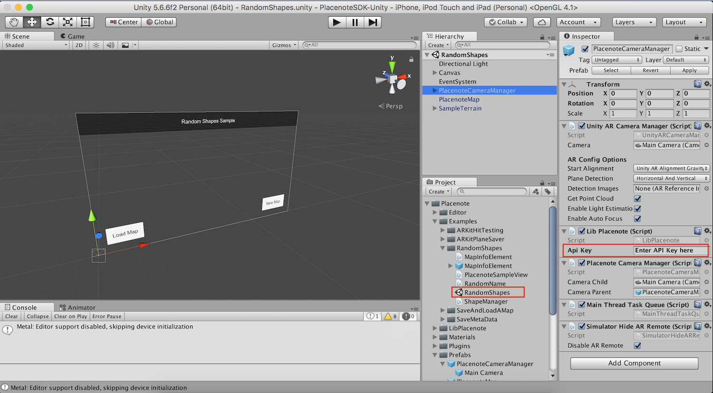

# Build and run the SDK sample code
Let's get started by building and running a basic Placenote sample app. In this example we will download the Unity SDK and build the **RandomShapes** scene. This sample project is identical to the demo app [we downloaded and tested in the previous step.](install-sample.md)

## Step 1: Download the SDK bundle
Download the [latest unity package.](https://placenote.com/unitysample)

## Step 2: Import into Unity
1. Create a new project in Unity and open it.
2. In the Unity Menu, go to Assets > Import Package > Custom Package and select the **.unitypackage** file to import.
3. In your project window, under the Assets folder, find Placenote/Examples/RandomShapes and double click on the RandomShapes Scene.

## Step 3: Add your API key
In the Scene Hierarchy, select PlacenoteCameraManager and add your API key to the LibPlacenote Component in the Inspector Panel.

!!! tip
    Don't have your API key? [Get it on your dev portal](https://developer.placenote.com).

## Step 4: Build and run the project
Read the [build instructions page](build-instructions.md) to run this project on an iOS device.
