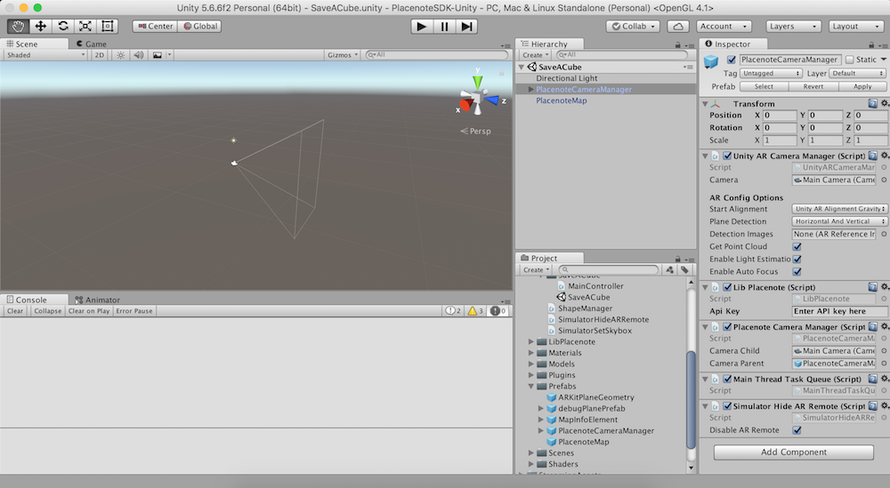

# Save and load your first map
This first tutorial will walk you though an example of how to create, save and reload a single map with some basic AR content in a physical location. To follow this tutorial, open the *SaveAndLoadAMap* Scene in the *Assets/Examples* folder. You will find that the *SaveAndLoadAMap.cs* script has been attached to the Canvas object in the Scene Hierarchy. Open that script file as well. 

## Step 1: Import Placenote into a new Unity project
1. Create a new Unity 3D project
2. Download the [latest Placenote unity package.](https://placenote.com/unitysample)
3. In the Unity Menu, go to *Assets > Import Package > Custom Package* and select the downloaded package to import.

!!! tip
    Placenote SDK comes packaged with the Unity ARKit Plugin as well as some third party plugins. If you already have any of these in your project, the import will skip adding those files from Placenote. This is ok and will not affect your project.

## Step 2: Configure the basic scene elements
1. If you have a *Camera* object in your scene, delete it.
2. In your *Assets* folder, Navigate to *Assets > Placenote > Prefabs* and drag *PlacenoteCameraManager* **and** *PlacenoteMap* into your scene.
3. Now in your scene hierarchy, click on *PlacenoteCameraManager* and in the inspector panel that opens up, add your API key to the API key box under the *LibPlacenote* script element.



## Step 3: Display a simple cube in AR
In the rest of this tutorial, we'll first build a very basic ARKit app that displays a cube at (0,0,0) and then modify the app to persistently load that cube at the same location every time the app is launched.

To start, add a canvas element to your scene and add a simple UI button to it. Now create a script called “MainController” and add this code to it.

!!! note
    Note that you need to add this script below as a component to your canvas element and link the UI Button with the `OnDropShapeClick()` function in the script.


``` csharp
using System.Collections;
using System.Collections.Generic;
using UnityEngine;

using UnityEngine.XR.iOS; // Import ARKit Library

public class MainController : MonoBehaviour {

  // Unity ARKit Session handler
  private UnityARSessionNativeInterface mSession;

  void Start () {

      mSession = UnityARSessionNativeInterface.GetARSessionNativeInterface ();
      StartARKit ();
  }

  void Update () {
      // Nothing to do here
  }

  // Add shape when button is clicked.
  public void OnDropShapeClick ()
  {
      GameObject shape = GameObject.CreatePrimitive (PrimitiveType.Cube);
      shape.transform.position = new Vector3 (0.0f, 0.0f, 1f);
      shape.transform.localScale = new Vector3 (0.3f, 0.3f, 0.3f);

  }

  // Initialize ARKit
  private void StartARKit ()
  {
      Application.targetFrameRate = 60;
      ARKitWorldTrackingSessionConfiguration config = new ARKitWorldTrackingSessionConfiguration ();
      config.planeDetection = UnityARPlaneDetection.Horizontal;
      config.alignment = UnityARAlignment.UnityARAlignmentGravity;
      config.getPointCloudData = true;
      config.enableLightEstimation = true;
      mSession.RunWithConfig (config);
  }
}
```

You can now build and run this app. You will notice that each time you open the app the sphere gets rendered in a new position. This is because the point (0,0,0) refers to where the latest ARKit session was initiated. It was easy to create the cube, but it is not persistent.

We can use Placenote SDK here to make the cube (or any GameObject) appear in the same place every time.

!!! note
    We're assuming here that you have some knowledge of ARKit development in Unity and will not be going into the details of that each of the functions above does. If you're new to Unity and ARKit, [you can check out this video tutorial.](https://www.youtube.com/watch?v=S7kKQZuOdlk) to get up to speed.

## Step 4: Initialize Placenote SDK

To start setting up Placenote, add `using System.Runtime.InteropServices;` to the top of the MainController script.

Next, add *PlacenoteListener* to your class definition like so.

``` csharp
public class MainController : MonoBehaviour, PlacenoteListener {
```

In our `start()` function, in addition to the ARKit initialization, let’s initialize Placenote and register its listener function.

``` csharp
FeaturesVisualizer.EnablePointcloud (); // Optional - to see the debug features
LibPlacenote.Instance.RegisterListener (this);
```

Finally, let’s add two Placenote event handler functions to your class like this. We will use these later.

``` csharp
// Runs when a new pose is received from Placenote.    
public void OnPose (Matrix4x4 outputPose, Matrix4x4 arkitPose) { }

// Runs when LibPlacenote sends a status change message like Localized!
public void OnStatusChange (LibPlacenote.MappingStatus prevStatus, LibPlacenote.MappingStatus currStatus)
{ }
```

## Step 5: Create, Save and Reload a Map

!!! warning
    Placenote version 1.6.8 introduces a breaking change in the LibPlacenote SDK. We have simplified the SDK initialization process by abstracting the sendFrame() function within LibPLacenote. To learn more check the [Migrating to SDK 1.6.8 from an earlier version]() on Unity page.

### Start a mapping Session
To start a mapping session simply add
``` csharp
LibPlacenote.Instance.StartSession ();
```
to the *OnDropShapeClick()* function.

### Saving a map
To save a map, let’s add another button to the Canvas and call it SaveButton.

We can now connect it to an *OnSaveMapClicked()* function like this. Notice that the LibPlacenote SaveMap function consists of 2 callback functions for the saving and uploading functions it runs. The save function returns a unique mapID you can store in your app. The Uploading function can be used to indicate the status of map upload to your user.

``` csharp
public void OnSaveMapClick ()
{
    if (!LibPlacenote.Instance.Initialized()) {
        Debug.Log ("SDK not yet initialized");
        return;
    }

    //mLabelText.text = "Saving...";
    LibPlacenote.Instance.SaveMap (
        (mapId) => {
            LibPlacenote.Instance.StopSession ();
            Debug.Log("Saved Map Id:" + mapId);

            },
        (completed, faulted, percentage) => {
            Debug.Log("Uploading map...");

            if(completed) {
                Debug.Log("Done Uploading!");
            }

        }
    );
}
```

Notice in the screenshot below that we have printed the mapID of the saved map to the console. We will use that map ID in the next step, when we reload the map.


### Reloading a map
To reload a map, let’s create a third UI Button on the canvas and call it “Load Map”. We’ll write a function that takes a previously created map ID and loads the corresponding map when the button is clicked. We'll copy the mapID we printed to the console when we saved the map and paste it in "Paste Map ID here" line below.

``` csharp
public void OnLoadMapClicked ()
{
    if (!LibPlacenote.Instance.Initialized()) {
        Debug.Log ("SDK not yet initialized");
        return;
    }

    // hard code a mapID in here until you can save mapID's
    var mSelectedMapId = "Paste Map ID here";

    LibPlacenote.Instance.LoadMap (mSelectedMapId,
        (completed, faulted, percentage) => {
            if (completed) {

                LibPlacenote.Instance.StartSession ();
                Debug.Log("Loaded ID: " + mSelectedMapId);
            } else if (faulted) {
                Debug.Log("Failed to load ID: " + mSelectedMapId);
            }
        }
    );
}
```


Finally we need to complete the onStatusChange() function to render our cube back into the scene when Placenote localizes the map.

Add this to your onStatusChange function you created earlier.

``` csharp
public void OnStatusChange (LibPlacenote.MappingStatus prevStatus, LibPlacenote.MappingStatus currStatus) {

    if (currStatus == LibPlacenote.MappingStatus.RUNNING && prevStatus == LibPlacenote.MappingStatus.LOST) {

            Debug.Log ("Localized!");
            GameObject shape = GameObject.CreatePrimitive (PrimitiveType.Cube);
            shape.transform.position = new Vector3 (0.0f, 0.0f, 0f);
            shape.transform.localScale = new Vector3 (0.3f, 0.3f, 0.3f);
    }
}
```

Lets run this app in place now! No matter where we start, we find the cube appearing in the exact same position we initially placed it.
