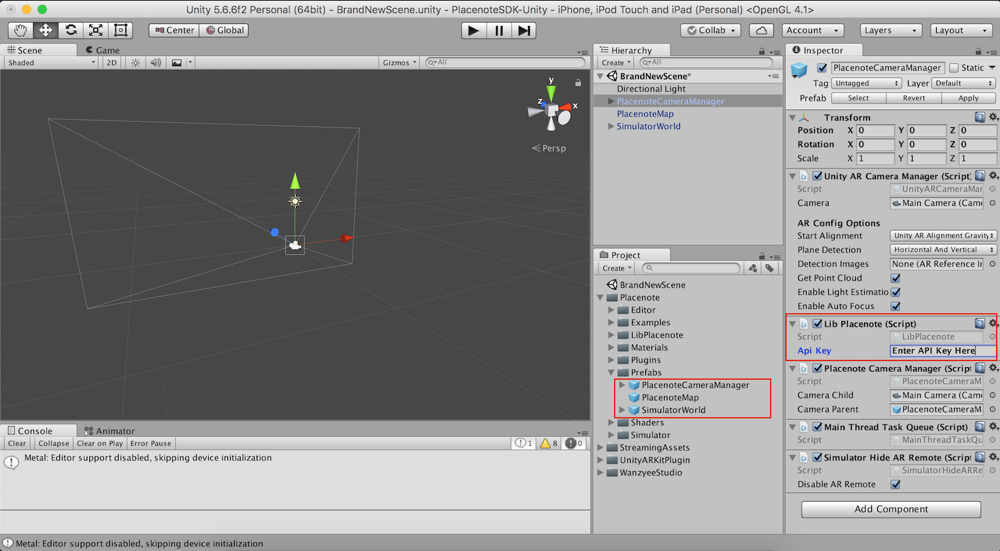
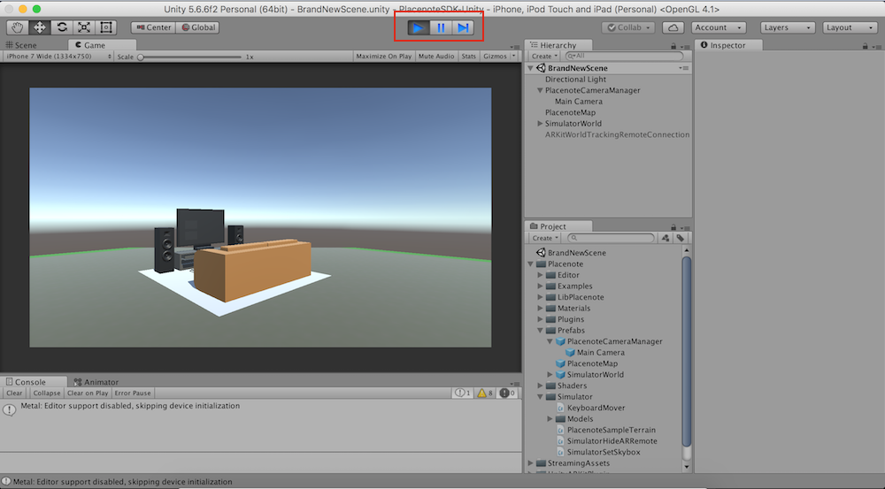

# Configuring a new Placenote Scene

When building a Placenote project from scratch, we need to first set up the Scene with some basic Placenote objects. We have provided 3 standard Prefabs in the *Assets/Placenote/Prefabs* folder that you will need to add to every brand new Placenote project. So let's get started with a new project.

## Step 1: Import Placenote into a new Unity project
* Create a new Unity 3D project
* Download the [latest Placenote unity package.](https://github.com/Placenote/PlacenoteSDK-Unity/releases/download/v1.6.12/PlacenoteSDK.unitypackage)
* In the Unity Menu, go to *Assets > Import Package > Custom Package* and select the downloaded package to import.
* Don't worry about all the checked boxes you see, the import process takes care of everything. 

!!! tip
    Placenote SDK comes packaged with the Unity ARKit Plugin as well as some third party plugins. If you already have any of these in your project, the import will skip adding those files from Placenote. This is ok and will not affect your project.  

## Step 2: Set up a new scene
* Create a new Scene and open it.
* If you see a *Main Camera* object in the scene, delete it. We will replace this with a custom Placenote Camera object.
* In your *Assets* folder, Navigate to *Assets > Placenote > Prefabs* and drag ***PlacenoteCameraManager***, ***PlacenoteMap***, and ***SimulatorWorld*** into your scene.
* Now in your scene hierarchy, click on *PlacenoteCameraManager* and in the inspector panel that opens up, add your API key to the API key box under the *LibPlacenote* script element. You can get your API key on the <a href="https://developer.placenote.com" target="_blank">developer portal</a> .   You can use this screenshot as a reference for the above steps.  

## Step 3: Test the Scene

Hit the Play button in Unity. You should see the simulator world show up in the Game view, as shown below. Use the "W", "A", "S", "D", "Left Arrow" and "Right Arrow" keys to move around. This will be our simulated environment to test our app in the Editor as we continue to build.    

Done! You're now ready to start building apps with Placenote.
