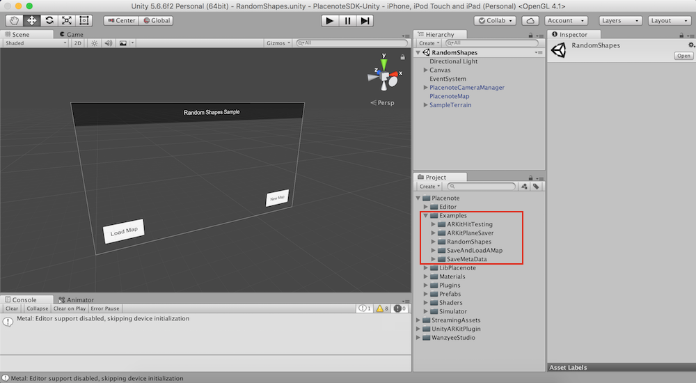

# Introduction to the Tutorials section
The tutorials in this section are designed to help you learn Placenote SDK through step by step guided coding, with increasing complexity. At the end of this section you will be able to quickly build and deploy Placenote apps from scratch. Each tutorial will have a corresponding sample project you can refer to in the Unity Package.

You can find all example scenes under *Assets/Placenote/Examples*, as shown below.

!!! tip
    The *RandomShapes* sample app we compiled [in the previous section](../build-sample-app.md) is a comprehensive sample app that implements most Placenote functionality. If you wish, you can skip the tutorials and modify this sample app but we recommend following these tutorials to help you gain a better understanding of how Placenote works and what you can do with it.
